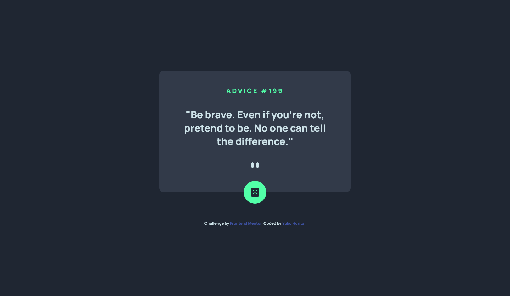
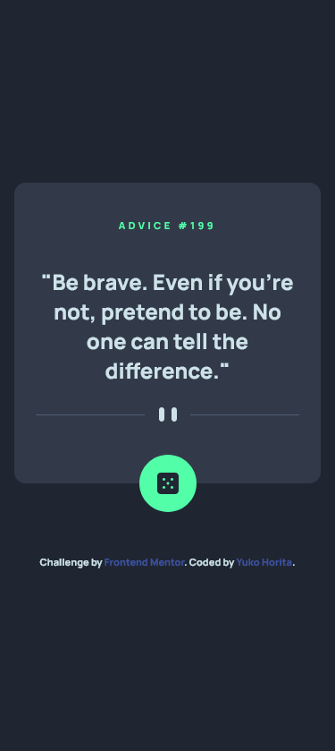

# Frontend Mentor - Advice generator app solution

This is a solution to the [Advice generator app challenge on Frontend Mentor](https://www.frontendmentor.io/challenges/advice-generator-app-QdUG-13db). Frontend Mentor challenges help you improve your coding skills by building realistic projects.

## Table of contents

- [Overview](#overview)
  - [The challenge](#the-challenge)
  - [Screenshot](#screenshot)
  - [Links](#links)
- [My process](#my-process)
  - [Built with](#built-with)
  - [What I learned](#what-i-learned)
  - [Continued development](#continued-development)
  - [Useful resources](#useful-resources)
- [Author](#author)

## Overview

This is my first project using [Remix](https://remix.run/). Remix can achieve fast loading, so I thought this would be good for this API project.

### The challenge

Users should be able to:

- View the optimal layout for the app depending on their device's screen size
- See hover states for all interactive elements on the page
- Generate a new piece of advice by clicking the dice icon

### Screenshot

**Desktop View (1440px wide)**


**Mobile View (375px wide)**


### Links

- Solution URL: [Add solution URL here](https://your-solution-url.com)
- Live Site URL: [https://advice-generator-remix.vercel.app/](https://advice-generator-remix.vercel.app/)

## My process

- Went through official Remix document and watched some tutorials to learn about Remix
- Read official document of [Advice Slip API](https://api.adviceslip.com/)
- Planned layouts and html tags from figma design
- Create html elements
- Coded styles in Scss files
- Added function to fetch data
- Added function on dice button
- Added animation when it's loading
- Pushed on GitHub
- Deployed on Vercel

### Built with

- Semantic HTML5 markup
- CSS custom properties
- Flexbox
- CSS Grid
- Sass / Scss
- Mobile-first workflow
- [Remix](https://remix.run/) - JS/React framework
- [Animista](http://animista.net) - CSS animation code generator

### What I learned

This project is done for learning purpose, so it may not be perfect. Remix is similar to Next.js, and it is easy to manage data loading. I fetched API as follows:

```js
import { useLoaderData } from 'remix';

export const loader = async () => {
  const ADVICE_URL = process.env.REMIX_APP_ADVICE_URL;
  const response = await fetch(ADVICE_URL);
  const data = await response.json();
  console.log(data);
  return data;
};
```

I also realised that to deploy the project on vercel, it is the best to select 'vercel' package when initially creating remix files.

### Continued development

Remix seems to be amazing for full-stack projects using prisma. I would like to build full-stack app when I am ready to learn more on backend.

### Useful resources

- [Remix Docs](https://remix.run/docs/en/v1)
- [Traversy Media: Remix Crash Course | Full Stack React](https://www.youtube.com/watch?v=d_BhzHVV4aQ) - This helped understanding basic functions of Remix. This course is also making full-stack app using prisma. I would like to learn more on this.

## Author

- Frontend Mentor - [@Sloth247](https://www.frontendmentor.io/profile/Sloth247)
